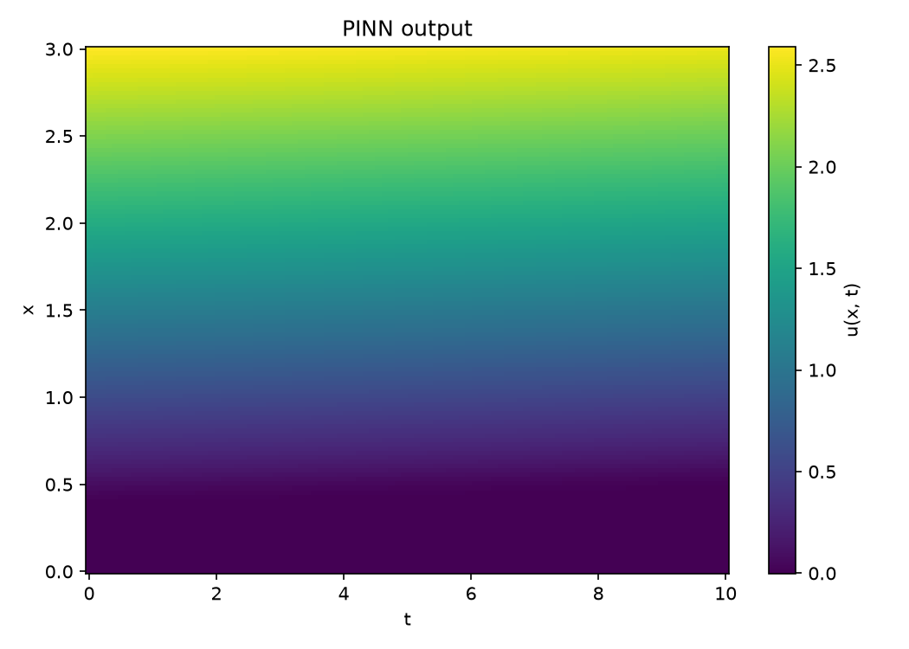
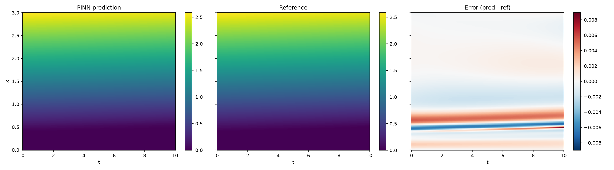
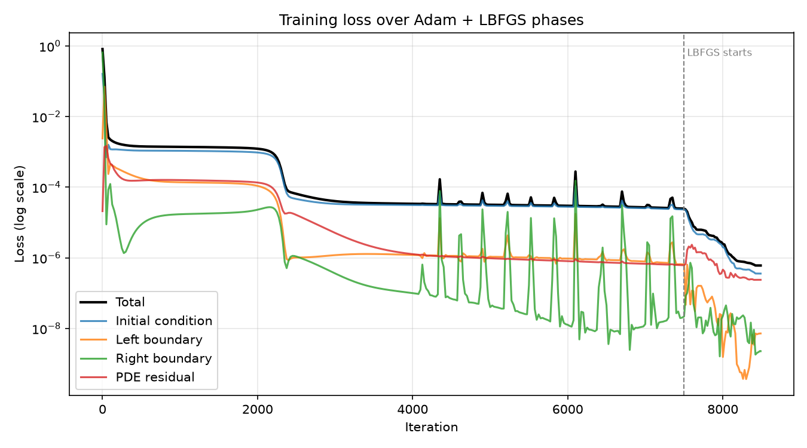
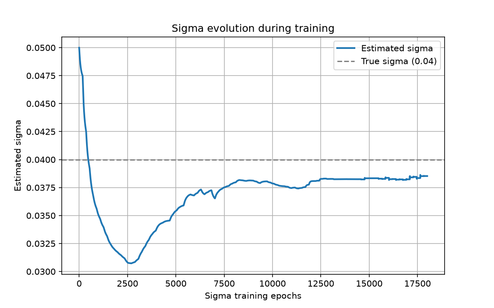

# expert-barnacle — Physics-Informed Neural Networks for Option Pricing

A PyTorch implementation of **Physics-Informed Neural Networks (PINNs)** that solve the Black-Scholes partial differential equation for European option pricing — both in the *forward* direction (predict option value from known parameters) and the *inverse* direction (calibrate implied volatility from observed price data). Includes synthetic PDE data generation, analytical/reference-based evaluation, and visualization tooling.


*Placeholder — replace with a 2D heatmap of the PINN's predicted option value `u(x, t)` over the (spot price, time) domain, generated by `plot_heatmap.py`. X-axis: spot price, Y-axis: time to expiry, color: option value. This is the single most important image in the README — it's the "does this actually work" proof.*

---

## PINN Methodology: Forward Solving, Inverse Calibration, and Validation

The network is trained by enforcing the PDE residual (using `torch.autograd.grad()`), boundary conditions, and initial condition by including them in the loss calculation. `main.py` creates a PINN that solves forward for a known contract. `backwards.py`, on the other hand, solves the inverse problem by using provided data in order to fit an unknown volatility parameter while learning the solution to the PDE at the same time.

Validation is done by comparing compare PINN output against the closed-form Black-Scholes formula, or against independently-generated reference solutions (via [`py-pde`](https://py-pde.readthedocs.io/)).

## Key results


*Placeholder — replace with a 3-panel plot (PINN prediction | analytical Black-Scholes solution | absolute error heatmap) from `eval_analytical.py` / `plot_heatmap.py --compare`. This is the accuracy proof — pick a run with low max error and report it in the caption (e.g. "max abs error < 1e-3 across the domain").*


*Placeholder — replace with a log-scale line chart of total loss and each individual loss term (initial condition, left/right boundary, PDE residual) over training iterations, spanning both the Adam and L-BFGS optimization phases (see the `[Adam]` / `[LBFGS]` log lines in `main.py`). Demonstrates the two-stage optimization strategy and convergence behavior.*


*Placeholder — replace with a line chart from `backwards.py` showing the estimated sigma (volatility) parameter converging toward its true value over training iterations. This is the clearest illustration of the inverse-problem capability — recovering a hidden physical parameter purely from data.*

## Primary Components

1. **Domain & PDE setup** (`common/classes.py`): `Domain` and `BlackScholesPDE` dataclasses define the (spot, time) grid and contract parameters.
2. **Network** (`pinn/model.py`): a basic fully-connected network (`FCN`) used in `pinn/main.py`, plus a `ConstrainedFCN` class for solving the inverse problem that hard-codes the contract payoff at time of maturity, in order to mitigate issues potentially caused by a non-differentiable payoff at time of maturity.
3. **Training** (`pinn/main.py`, `pinn/backwards.py`): the loss combines the PDE residual with initial- and boundary-condition losses. Training runs Adam first for coarse convergence, then switches to L-BFGS for fine-grained convergence.
4. **Data generation** (`gen/data_gen.py`, `gen/funcs.py`): synthetic reference solutions for various PDEs are generated with `py-pde` and stored as .hdf5 files. The data can then be used as training data for the `pinn/backwards.py`, or as reference data for `pinn/eval_hdf5.py`.
5. **Evaluation** (`pinn/eval_analytical.py`, `pinn/eval_hdf5.py`): trained models are checked against closed-form solutions or against stored .hdf5 reference data.
6. **Visualization** (`pinn/plot_heatmap.py`, `data/visual/visualize.py`): Various plotting and visualization scripts, for internal usage.

## Project structure

```
expert-barnacle/
├── src/
│   ├── pinn/
│   │   ├── model.py           # FCN and ConstrainedFCN network definitions
│   │   ├── main.py             # Forward-solving training loop (option pricing)
│   │   ├── backwards.py       # Inverse problem: calibrate volatility (sigma)
│   │   ├── eval_analytical.py # Compare PINN vs. closed-form Black-Scholes
│   │   ├── eval_hdf5.py       # Compare PINN vs. stored reference solutions
│   │   ├── pinn_io.py         # Checkpoint save/load with metadata
│   │   └── plot_heatmap.py    # Heatmap plotting / grid prediction utilities
│   ├── common/
│   │   ├── classes.py         # Domain, BlackScholesPDE, Option dataclasses
│   │   ├── pinn_helpers.py    # Boundary/initial condition + derivative helpers
│   │   ├── funcs.py           # HDF5 loading, subsampling utilities
│   │   └── globals.py         # Shared constants/defaults
│   ├── gen/
│   │   ├── data_gen.py        # CLI for generating synthetic PDE training data
│   │   └── funcs.py           # PDE factory functions (Black-Scholes, Allen-Cahn, diffusion)
│   └── data/visual/
│       └── visualize.py       # Standalone HDF5 (py-pde) visualizer/movie generator
├── models/                    # Saved model checkpoints (.pt)
└── figs/                      # Generated plots (see above)
```

## Getting started

```bash
# Requires Python (see .python-version) and a virtual environment of your choice
pip install torch numpy py-pde h5py matplotlib

# Train a forward PINN for a European call option
cd src/pinn
python main.py -s ../../models/pinn.pt

# Evaluate against the closed-form solution
python eval_analytical.py --checkpoint ../../models/pinn.pt --nx 200 --nt 200

# Generate synthetic reference data, then calibrate volatility from it
cd ../gen
python data_gen.py ../data/bs_run 0.0 black_scholes EUROCALL 1 0.04 0.03 10
cd ../pinn
python backwards.py -d ../data/bs_run.hdf5 -s ../../models/pinn_backward.pt
```

## Tech stack

`PyTorch` (autograd-based PDE residuals, model training) · `py-pde` (reference PDE solving/synthetic data) · `NumPy` · `h5py` (data storage) · `Matplotlib` (visualization)

## Possible extensions

- American options / early-exercise boundaries
- Stochastic volatility models (Heston) as a harder inverse-problem benchmark
- Multi-asset (basket option) pricing in higher dimensions
- Uncertainty quantification on the calibrated volatility estimate
- Improved modularization to allow for quick implementation of user-defined PDEs.
